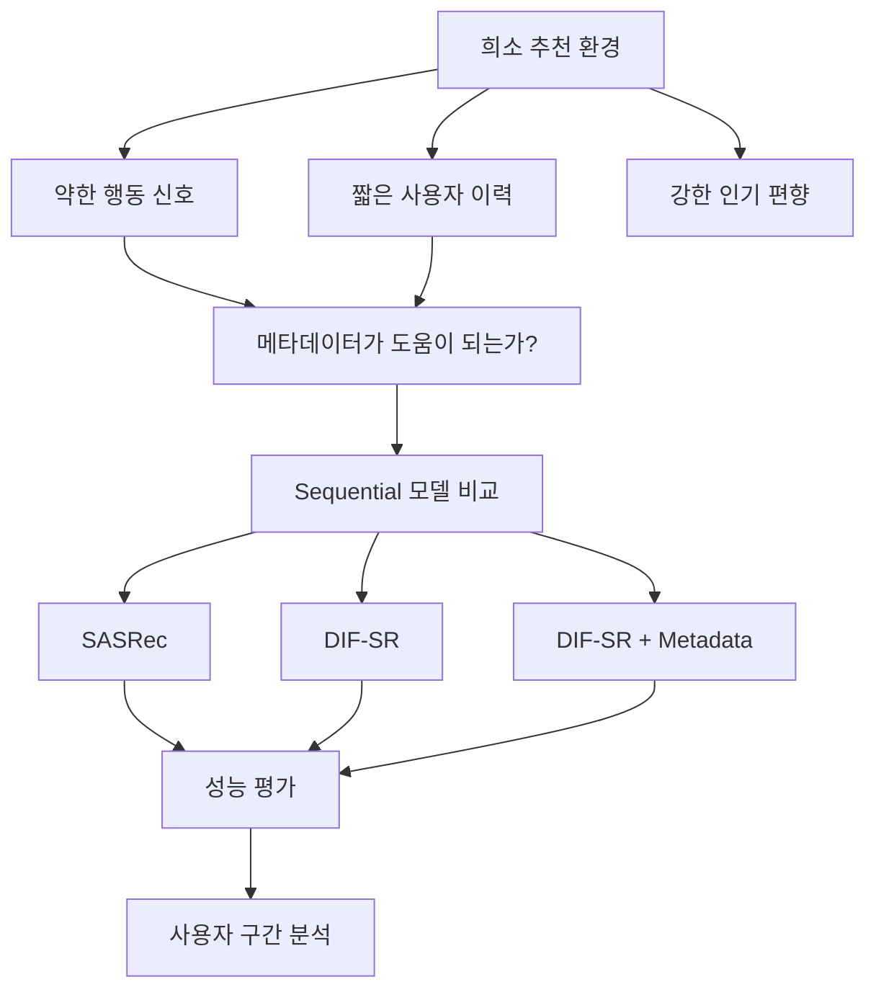
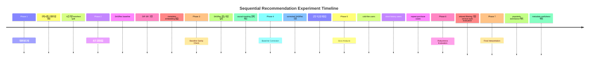
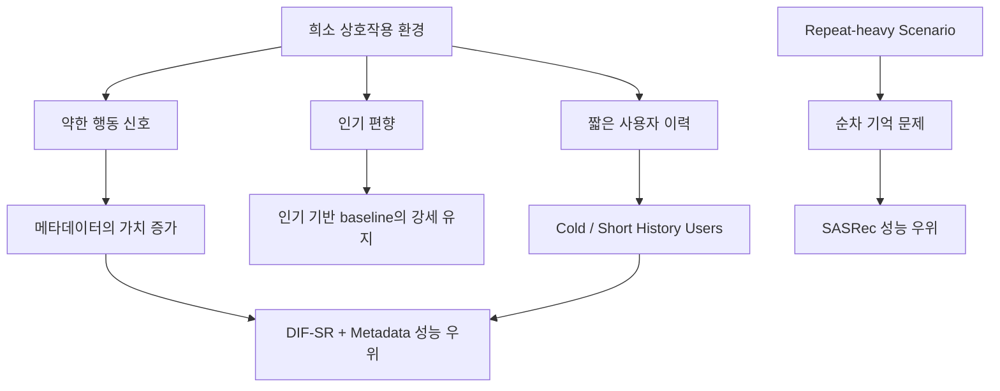

# 희소 상호작용 환경에서의 Sequential Recommendation

이 프로젝트는 sparse한 marketplace형 환경에서 추천 시스템이 어떻게 동작하는지를 탐구하는 더 큰 연구의 일부입니다.

이 저장소는 H&M 거래 데이터로부터 구성한 구매 시퀀스를 사용해, 극도로 희소한 상호작용 환경에서 sequential recommendation이 어떻게 동작하는지 분석합니다.

이 프로젝트는 다음 세 가지 질문에 답하는 것을 목표로 합니다.

- item metadata가 추천 성능을 개선하는가?
- 어떤 사용자 구간에서 metadata가 특히 더 유용해지는가?
- 약한 behavioral signal 환경에서 모델 구조 차이가 어떻게 작동하는가?

최종 아티팩트는 다음을 포함하는 연구형 실험 패키지로 구성되어 있습니다.

- baseline verification
- canonical research evaluation
- service-style robustness evaluation
- user regime별 slice analysis
- dataset regime 해석

## 빠른 이동

- 메인 보고서: [`reports/README.md`](reports/README.md)
- 최종 config 인덱스: [`configs/README.md`](configs/README.md)
- 저장소 가이드: [`REPOSITORY_GUIDE.md`](REPOSITORY_GUIDE.md)
- framework 문서: [`docs/framework/`](docs/framework)

## TL;DR

최종 실험의 핵심 관찰은 다음과 같습니다.

- `TopPopular`가 전체적으로 가장 강하며, 이는 이 데이터셋의 popularity dominance가 매우 강하다는 뜻입니다.
- personalized model 중에서는 `DIF-SR + Metadata`가 가장 높은 성능을 보였습니다.
- metadata는 cold-like user와 short-history user에서 가장 큰 이득을 보였습니다.
- repeat-heavy scenario는 일반 sparse recommendation과 다르게 동작하며, SASRec 같은 memorization 친화적 sequence model이 더 유리했습니다.
- baseline verification 이후 모델 비교 해석이 실질적으로 달라졌습니다.

## 연구 질문

이 프로젝트는 behavioral signal이 약한 환경에서 sequential recommender가 어떻게 동작하는지, 그리고 item metadata가 sparse interaction history를 얼마나 보완할 수 있는지를 분석합니다.



## 실험 파이프라인

이 파이프라인은 sequential dataset을 구성하고, 네 가지 추천 모델을 학습한 뒤, 여러 평가 체계에서 성능을 비교하고 slice analysis를 수행합니다.


## 실험 타임라인

실험 도중 SASRec baseline의 성능 이상이 발견되었고, 이를 점검하는 과정에서 원래 구현에 causal masking이 빠져 있다는 것을 확인했습니다. 이후 baseline을 수정한 뒤 동일 조건에서 모델 비교를 다시 맞췄습니다.



## 데이터셋

데이터셋은 익명화된 구매 이벤트를 포함한 로컬 H&M 거래 파일로부터 구성했습니다.

공개 범위 안내:

- 원본 transaction 데이터와 로컬에서 파생된 dataset 파일은 이 public 저장소에 포함하지 않습니다.
- 이 저장소에는 실험 설계 검토와 저장된 산출물 기반 포트폴리오 재구성을 위해 필요한 코드, config, 보고서, 분석 아티팩트를 포함합니다.

### 데이터셋 통계

- Users: `22,258`
- Items: `29,785`
- Interactions: `135,412`
- Average sequence length: `9.35`
- Median sequence length: `6`
- Sparsity: `99.98%`

### 사용한 Metadata

- `product_type`
- `department`
- `garment_group`

### 데이터셋 특징

- 극도로 희소한 interaction matrix
- 짧은 사용자 이력
- 강한 popularity bias

사용자 ID는 해시된 식별자(`userhash32`)이며, 구매 이벤트를 timestamp 순으로 정렬해 sequence를 구성했습니다.

시간 기반 분할:

- `week < 27 -> train`
- `week == 27 -> test`

즉, 이 프로젝트는 temporal next-item prediction 설정을 사용합니다.

## 실험 오케스트레이션 프레임워크

실험은 연구 workflow를 재현 가능하고 추적 가능하게 만들기 위한 구조화된 agent-driven experimentation framework 위에서 수행했습니다.

핵심 framework 문서:

- 정책: [`docs/framework/AGENT.md`](docs/framework/AGENT.md)
- 실행 절차: [`docs/framework/RUNBOOK.md`](docs/framework/RUNBOOK.md)
- 반복 루프: [`docs/framework/SELF_EVOLUTION_LOOP.md`](docs/framework/SELF_EVOLUTION_LOOP.md)
- 프로토콜: [`docs/framework/protocol.md`](docs/framework/protocol.md)

### Skills

재사용 가능한 실행 모듈을 다음 작업에 사용했습니다.

- dataset preprocessing
- model training
- evaluation
- slice analysis
- metric aggregation
- plot generation

### Multi-Agent Roles

에이전트는 실험 수명주기의 서로 다른 단계에서 역할을 맡습니다.

- Experiment Planner
- Training Agent
- Evaluation Agent
- Analysis Agent

### Phase-Based Experimentation

실험은 다음과 같은 phase로 구성됩니다.

- baseline verification
- model comparison
- slice analysis
- robustness evaluation

### Self-Evolution Loop

workflow는 다음과 같은 반복 구조를 따릅니다.

`run experiment -> analyze anomaly -> refine configuration -> rerun experiment`

이 루프는 잘못된 SASRec baseline을 찾아내고, 실험 수정 이력을 추적 가능하게 유지하는 데 핵심적이었습니다.

## Baseline Verification

초기 SASRec baseline은 다음 두 가지 이유로 신뢰하기 어려웠습니다.

- causal masking 누락
- 지나치게 약한 학습 설정

초기 SASRec:

- `Recall@20: 0.0006`
- `NDCG@20: 0.0002`

causal masking을 복구하고 다시 학습한 뒤의 corrected SASRec:

- `Recall@20: 0.0113`
- `NDCG@20: 0.0040`
- `MRR@20: 0.0020`

이 단계는 실험의 과학적 타당성을 크게 높였습니다.

상세 메모:

- [`SASREC_SANITY_FIX.md`](SASREC_SANITY_FIX.md)

## 모델

최종 아티팩트에서는 네 가지 모델을 비교합니다.

### TopPopular

전역 인기 기반 추천기.

### Corrected SASRec

Transformer 기반 sequential recommender.

### DIF-SR

의도 분리형 intent-aware sequential recommender.

### DIF-SR + Metadata

item metadata embedding을 결합한 DIF-SR.

## Canonical Evaluation (Primary Artifact)

메인 실험은 연구용으로 정제된 clean evaluation setting을 사용합니다.

필터링 규칙:

- cold user 제거
- cold item 제거
- zero-history user 제거
- repeat purchase 제거

### 결과


| Model | Recall@20 | NDCG@20 | MRR@20 |
| --- | ---: | ---: | ---: |
| TopPopular | 0.0280 | 0.0102 | 0.0055 |
| Corrected SASRec | 0.0113 | 0.0040 | 0.0020 |
| DIF-SR | 0.0155 | 0.0061 | 0.0036 |
| DIF-SR + Metadata | 0.0184 | 0.0075 | 0.0045 |

personalized model 중에서는 `DIF-SR + Metadata`가 가장 좋았습니다.

다만 clean research setting에서도 `TopPopular`가 전체적으로 가장 강했으며, 이는 이 데이터셋의 popularity dominance가 여전히 매우 강하다는 뜻입니다.

canonical 보고서:

- [`reports/canonical_evaluation.md`](reports/canonical_evaluation.md)

## Service-Style Evaluation (Robustness)

추가적인 supplementary evaluation으로 실제 서비스 조건에 더 가까운 환경을 시뮬레이션했습니다.

완화된 필터링:

- cold-like user 허용
- zero-history 허용
- repeat purchase 허용

### 결과


| Model | Recall@20 | NDCG@20 | MRR@20 |
| --- | ---: | ---: | ---: |
| TopPopular | 0.0293 | 0.0111 | 0.0061 |
| Corrected SASRec | 0.0147 | 0.0099 | 0.0085 |
| DIF-SR | 0.0169 | 0.0086 | 0.0063 |
| DIF-SR + Metadata | 0.0202 | 0.0093 | 0.0063 |

`DIF-SR + Metadata`는 여기서도 personalized model 중 가장 강했습니다.

repeat purchase를 허용하면 일부 target이 더 쉬워지므로 aggregate metric은 소폭 상승합니다.

service-style 보고서:

- [`reports/service_style_evaluation.md`](reports/service_style_evaluation.md)

## Slice Analysis

서로 다른 사용자 구간은 서로 다른 모델을 선호합니다.

- cold-like / short-history user -> `DIF-SR + Metadata`
- repeat-heavy scenario -> `Corrected SASRec`


### Cold-Like Users

`DIF-SR + Metadata`

- `Recall@20: 0.0233`
- `NDCG@20: 0.0116`

behavioral signal이 약할수록 metadata의 가치가 더 커집니다.

### Short History Users

`DIF-SR + Metadata`

- `Recall@20: 0.0239`
- `NDCG@20: 0.0107`

짧은 interaction history에서는 metadata가 추천 성능을 뚜렷하게 개선합니다.

### Repeat Purchase Cases

`Corrected SASRec`

- `Recall@20: 0.3194`
- `NDCG@20: 0.2640`

repeat-heavy scenario는 일반적인 sparse recommendation보다 memorization problem에 더 가깝게 동작합니다.

## 결과 해석



이 결과는 모델 구조만 복잡하게 만든다고 해서 extreme sparsity를 쉽게 극복할 수 없음을 보여줍니다.

실제로 의미 있는 개선은 주로 다음에서 나옵니다.

- metadata signal
- 더 풍부한 behavioral history
- 도메인 특화 recommendation policy

## 왜 이 데이터셋에서는 Popularity가 지배적인가?

전 실험에서 가장 눈에 띄는 관찰 중 하나는 `TopPopular`가 전체적으로 가장 강한 모델로 남았다는 점입니다.

이 현상은 극도로 sparse한 추천 환경에서 드문 일이 아니며, 이 데이터셋의 세 가지 구조적 특성으로 설명할 수 있습니다.

### 1. 매우 희소한 Interaction Matrix

이 데이터셋은 다음 규모를 가집니다.

- `22k` users
- `29k` items
- `135k` interactions
- 평균 sequence 길이 약 `9`
- 중간 sequence 길이 `6`

즉 대부분의 사용자는 아주 적은 수의 item과만 상호작용합니다.

behavioral evidence가 부족하면 안정적인 사용자 선호를 학습하기 어렵습니다. 이런 환경에서는 전역 인기 신호가 미래 상호작용을 예측하는 강한 기준이 되기 쉽습니다.

### 2. 짧은 사용자 이력

상당수 사용자가 short-history regime에 속합니다.

이 환경에서는 대체로 다음 관계가 성립합니다.

`behavior signal < popularity signal`

Sequential model은 의미 있는 과거 패턴에 의존합니다. 하지만 sequence 길이가 너무 짧으면 사용자 의도를 충분히 안정적으로 추론할 수 없어서, popularity를 일관되게 이기기 어렵습니다.

### 3. Marketplace형 수요 분포

구매 데이터는 보통 heavy-tailed demand distribution을 따릅니다.

- 소수의 item은 매우 인기 있고
- 다수의 item은 거의 구매되지 않습니다

이 분포에서는 인기 item이 test target으로 자주 등장하므로, popularity-based recommender가 구조적으로 유리합니다.

### 추천 시스템 관점의 함의

이 결과는 실무적으로 중요한 시사점을 줍니다.

희소 추천 환경에서는 모델 구조를 개선하는 것만으로 단순 popularity baseline을 넘기기 어려울 수 있습니다.

실제 개선은 보통 다음과 같은 요소를 함께 필요로 합니다.

- metadata 같은 추가 contextual signal
- 더 풍부한 user interaction history
- 더 강한 candidate generation 전략
- 도메인 특화 recommendation policy

이 점은 sparsity와 popularity bias가 흔한 marketplace 추천 시스템과도 자연스럽게 연결됩니다.

## 핵심 인사이트

1. popularity dominance는 이 데이터셋의 가장 강한 특성입니다.
2. baseline verification 이후 모델 비교 해석이 크게 달라졌습니다.
3. metadata는 behavioral signal이 약한 환경에서 가장 유용합니다.
4. evaluation regime에 따라 aggregate metric 해석이 달라집니다.
5. 서로 다른 regime은 서로 다른 모델을 선호합니다.

## 재현성

이 public 저장소는 저장된 실험 산출물을 기반으로 artifact를 재생성하고 보고서를 다시 패키징하는 용도를 지원합니다.
원본 로컬 transaction 데이터는 배포하지 않기 때문에, raw data에서 시작하는 full end-to-end reproduction은 제공하지 않습니다.

메인 연구 분석 실행:

```bash
source .venv/bin/activate
python experiments/run_evaluation.py
```

phase-aware automation entrypoint 실행:

```bash
python scripts/run_phase_agent.py
```

service-style supplementary evaluation 보고서 생성:

```bash
source .venv/bin/activate
python scripts/generate_service_style_eval.py
```

최종 포트폴리오 plot 및 curated report 생성:

```bash
source .venv/bin/activate
python experiments/package_portfolio_artifact.py
```

주요 아티팩트:

- baseline sanity note: [`SASREC_SANITY_FIX.md`](SASREC_SANITY_FIX.md)
- canonical report: [`reports/canonical_evaluation.md`](reports/canonical_evaluation.md)
- service-style report: [`reports/service_style_evaluation.md`](reports/service_style_evaluation.md)
- portfolio summary: [`reports/research_summary.md`](reports/research_summary.md)
- repository guide: [`REPOSITORY_GUIDE.md`](REPOSITORY_GUIDE.md)
- update log index: [`updates/README.md`](updates/README.md)
- phase-agent logs: [`updates/4.portfolio-closure/`](updates/4.portfolio-closure)

## 프로젝트 구조

```text
datasets/
configs/
docs/
experiments/
analysis/
plots/
reports/
README.md
```
