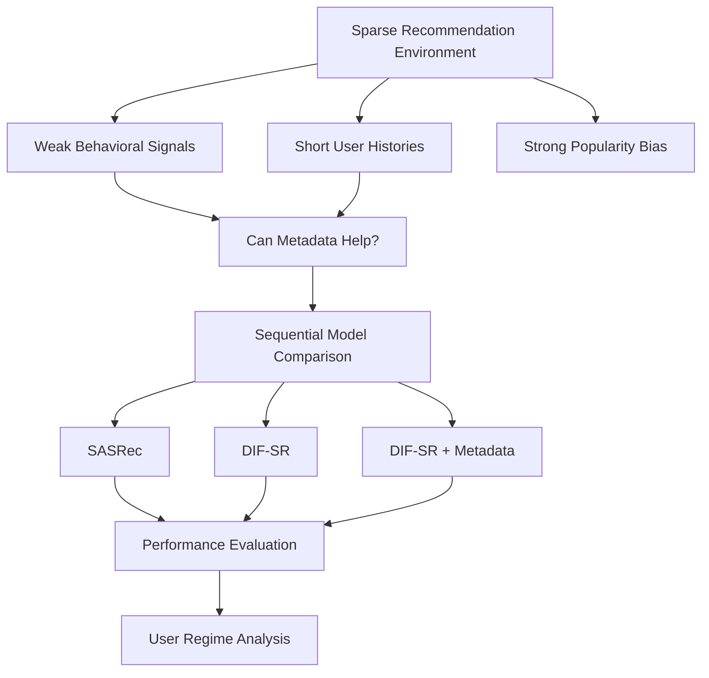
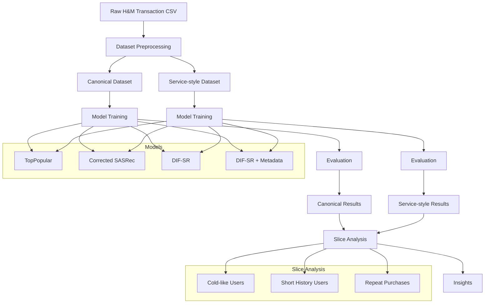
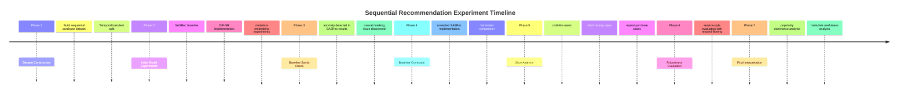
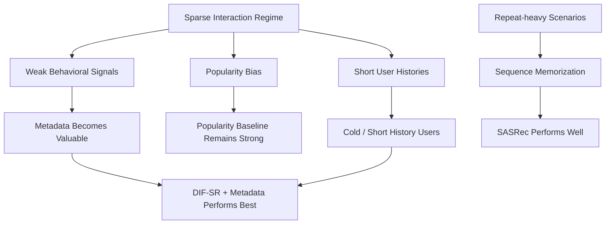

# Sequential Recommendation under Sparse Interaction Regimes

이 프로젝트는 sparse한 marketplace형 환경에서 추천 시스템이 어떻게 동작하는지를 탐구하는 더 큰 연구의 일부입니다.

This repository studies sequential recommendation under extremely sparse interaction regimes using purchase sequence data derived from H&M transactions.

The project is designed to answer three questions:

- Does item metadata improve recommendation performance?
- Under which user regimes does metadata become most useful?
- How does model architecture interact with weak behavioral signals?

The final artifact is organized as a research-style experiment package including:

- baseline verification
- canonical research evaluation
- service-style robustness evaluation
- slice analysis across user regimes
- dataset regime interpretation

## Quick Navigation

- main reports: [`reports/README.md`](reports/README.md)
- final config index: [`configs/README.md`](configs/README.md)
- repository guide: [`REPOSITORY_GUIDE.md`](REPOSITORY_GUIDE.md)
- framework docs: [`docs/framework/`](docs/framework)

## TL;DR

Key observations from the final experiments:

- `TopPopular` remains the strongest overall model, indicating strong popularity dominance.
- `DIF-SR + Metadata` performs best among personalized models.
- Metadata provides the largest benefit for cold-like users and short-history users.
- Repeat-heavy scenarios behave differently and favor memorization-friendly sequence models such as SASRec.
- Baseline verification materially changed the interpretation of model comparisons.

## Research Question

The project investigates how sequential recommenders behave when behavioral signal is weak, and whether item metadata can compensate for sparse interaction histories.



## Experiment Pipeline

The pipeline constructs sequential datasets, trains four recommendation models, evaluates them under multiple regimes, and performs slice analysis.



## Experiment Timeline

During experimentation, a baseline anomaly revealed that the original SASRec implementation lacked causal masking. After correcting the baseline, model comparisons were repeated under aligned conditions.



## Dataset

The dataset is derived from a local H&M transaction file containing anonymized purchase events.

### Dataset Statistics

- Users: `22,258`
- Items: `29,785`
- Interactions: `135,412`
- Average sequence length: `9.35`
- Median sequence length: `6`
- Sparsity: `99.98%`

### Metadata Features

- `product_type`
- `department`
- `garment_group`

### Dataset Characteristics

- extremely sparse interaction matrix
- short user histories
- strong popularity bias

User IDs are hashed identifiers (`userhash32`), and purchase events are sorted by timestamp to form sequences.

Temporal split:

- `week < 27 -> train`
- `week == 27 -> test`

This simulates next-item prediction in a temporal recommendation setting.

## Experiment Orchestration Framework

Experiments were executed with a structured, agent-driven experimentation framework designed to make research workflows reproducible and traceable.

Key framework documents:

- policy: [`docs/framework/AGENT.md`](docs/framework/AGENT.md)
- run procedure: [`docs/framework/RUNBOOK.md`](docs/framework/RUNBOOK.md)
- iterative loop: [`docs/framework/SELF_EVOLUTION_LOOP.md`](docs/framework/SELF_EVOLUTION_LOOP.md)
- protocol: [`docs/framework/protocol.md`](docs/framework/protocol.md)

### Skills

Reusable execution modules were used for:

- dataset preprocessing
- model training
- evaluation
- slice analysis
- metric aggregation
- plot generation

### Multi-Agent Roles

Agents operate at different stages of the experiment lifecycle:

- Experiment Planner
- Training Agent
- Evaluation Agent
- Analysis Agent

### Phase-Based Experimentation

Experiments are organized into explicit phases:

- baseline verification
- model comparison
- slice analysis
- robustness evaluation

### Self-Evolution Loop

The workflow follows a simple iterative structure:

`run experiment -> analyze anomaly -> refine configuration -> rerun experiment`

This loop was critical for detecting the invalid SASRec baseline and keeping experiment revisions traceable.

## Baseline Verification

The initial SASRec baseline was unreliable due to:

- missing causal masking
- overly weak training configuration

Initial SASRec:

- `Recall@20: 0.0006`
- `NDCG@20: 0.0002`

After fixing causal masking and retraining:

Corrected SASRec:

- `Recall@20: 0.0113`
- `NDCG@20: 0.0040`
- `MRR@20: 0.0020`

This step substantially improved the scientific validity of the experiment.

Detailed note:

- [`SASREC_SANITY_FIX.md`](SASREC_SANITY_FIX.md)

## Models

Four models are compared in the final artifact.

### TopPopular

Global popularity recommender.

### Corrected SASRec

Transformer-based sequential recommender.

### DIF-SR

Intent-aware sequential recommender.

### DIF-SR + Metadata

DIF-SR augmented with item metadata embeddings.

## Canonical Evaluation (Primary Artifact)

The main experiment uses a clean research-style evaluation setup.

Filtering rules:

- remove cold users
- remove cold items
- remove zero-history users
- remove repeat purchases

### Results


| Model | Recall@20 | NDCG@20 | MRR@20 |
| --- | ---: | ---: | ---: |
| TopPopular | 0.0280 | 0.0102 | 0.0055 |
| Corrected SASRec | 0.0113 | 0.0040 | 0.0020 |
| DIF-SR | 0.0155 | 0.0061 | 0.0036 |
| DIF-SR + Metadata | 0.0184 | 0.0075 | 0.0045 |

Among personalized models, `DIF-SR + Metadata` performs best.

However, `TopPopular` remains the strongest overall model, indicating strong popularity dominance even under the clean research setting.

Canonical report:

- [`reports/canonical_evaluation.md`](reports/canonical_evaluation.md)

## Service-Style Evaluation (Robustness)

A supplementary evaluation simulates more realistic service conditions.

Relaxed filtering:

- cold-like users allowed
- zero-history allowed
- repeat purchases allowed

### Results


| Model | Recall@20 | NDCG@20 | MRR@20 |
| --- | ---: | ---: | ---: |
| TopPopular | 0.0293 | 0.0111 | 0.0061 |
| Corrected SASRec | 0.0147 | 0.0099 | 0.0085 |
| DIF-SR | 0.0169 | 0.0086 | 0.0063 |
| DIF-SR + Metadata | 0.0202 | 0.0093 | 0.0063 |

`DIF-SR + Metadata` remains the strongest personalized model.

Aggregate metrics increase slightly because allowing repeat purchases makes some targets easier to recover.

Service-style report:

- [`reports/service_style_evaluation.md`](reports/service_style_evaluation.md)

## Slice Analysis

Different user regimes favor different models.

- cold-like and short-history users -> `DIF-SR + Metadata`
- repeat-heavy scenarios -> `Corrected SASRec`


### Cold-Like Users

`DIF-SR + Metadata`

- `Recall@20: 0.0233`
- `NDCG@20: 0.0116`

Metadata becomes more useful when behavioral signal is weak.

### Short History Users

`DIF-SR + Metadata`

- `Recall@20: 0.0239`
- `NDCG@20: 0.0107`

Metadata significantly improves recommendations for short interaction histories.

### Repeat Purchase Cases

`Corrected SASRec`

- `Recall@20: 0.3194`
- `NDCG@20: 0.2640`

Repeat-heavy scenarios behave more like memorization problems than standard sparse recommendation.

## Result Interpretation



The results suggest that model architecture alone cannot easily overcome extreme sparsity.

In practice, meaningful improvements often require:

- metadata signals
- richer behavioral histories
- domain-specific recommendation policies

## Why Does Popularity Dominate in This Dataset?

One striking observation across all experiments is that `TopPopular` remains the strongest overall model.

This is not unusual in extremely sparse recommendation environments and can be explained by three structural properties of the dataset.

### 1. Extremely Sparse Interaction Matrix

The dataset contains:

- `22k` users
- `29k` items
- `135k` interactions
- average sequence length of about `9`
- median sequence length of `6`

This means most users interact with only a small number of items.

When behavioral evidence is limited, it becomes difficult to learn stable user preferences. In such regimes, global popularity is often a strong predictor of future interactions.

### 2. Short User Histories

A large portion of users fall into the short-history regime.

In this setting, the relationship is often:

`behavior signal < popularity signal`

Sequential models rely on meaningful historical patterns. When sequences contain only a few interactions, user intent cannot be inferred reliably enough to consistently beat popularity.

### 3. Marketplace-like Demand Distribution

Purchase datasets often follow a heavy-tailed demand distribution:

- a small number of items are very popular
- many items are rarely purchased

Under this distribution, popular items appear frequently in test targets, which naturally benefits popularity-based recommenders.

### Implication for Recommender Systems

These results highlight an important practical insight:

In sparse recommendation environments, improving model architecture alone may not be sufficient to outperform simple popularity baselines.

In practice, improvements often require:

- additional contextual signals such as metadata
- richer user interaction histories
- stronger candidate generation strategies
- domain-specific recommendation policies

This connects naturally to marketplace recommendation systems, where sparsity and popularity bias are common.

## Key Insights

1. Popularity dominance is the strongest dataset property.
2. Baseline verification dramatically changed the interpretation of model comparisons.
3. Metadata is most useful when behavioral signals are weak.
4. Evaluation regimes influence aggregate metrics.
5. Different regimes favor different models.

## Reproducibility

Run the main research analysis:

```bash
source .venv/bin/activate
python experiments/run_evaluation.py
```

Run the phase-aware automation entrypoint:

```bash
python scripts/run_phase_agent.py
```

Generate the service-style supplementary evaluation report:

```bash
source .venv/bin/activate
python scripts/generate_service_style_eval.py
```

Generate final portfolio plots and curated reports:

```bash
source .venv/bin/activate
python experiments/package_portfolio_artifact.py
```

Key artifacts:

- baseline sanity note: [`SASREC_SANITY_FIX.md`](SASREC_SANITY_FIX.md)
- canonical report: [`reports/canonical_evaluation.md`](reports/canonical_evaluation.md)
- service-style report: [`reports/service_style_evaluation.md`](reports/service_style_evaluation.md)
- portfolio summary: [`reports/research_summary.md`](reports/research_summary.md)
- repository guide: [`REPOSITORY_GUIDE.md`](REPOSITORY_GUIDE.md)
- latest phase-agent log: [`updates/6.portfolio-closure/2026-03-15-2155-phase-agent-run.md`](updates/6.portfolio-closure/2026-03-15-2155-phase-agent-run.md)

## Project Structure

```text
datasets/
configs/
docs/
experiments/
analysis/
plots/
reports/
README.md
```
