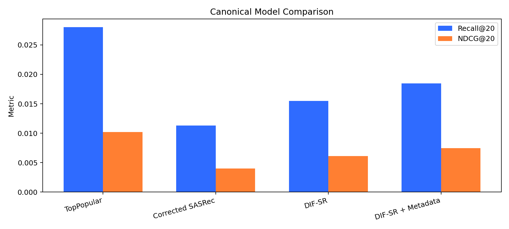
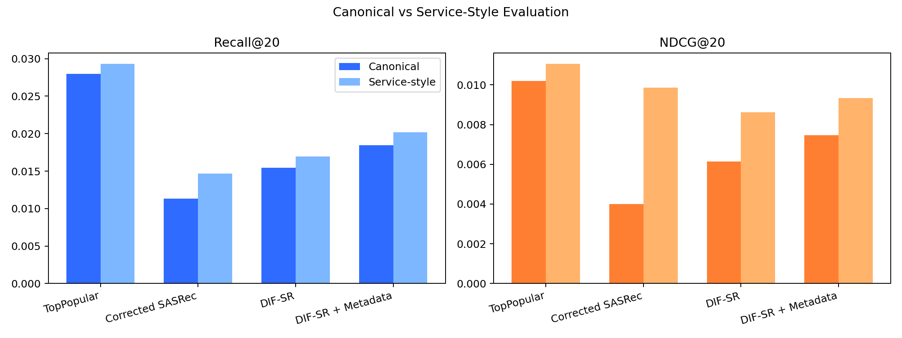
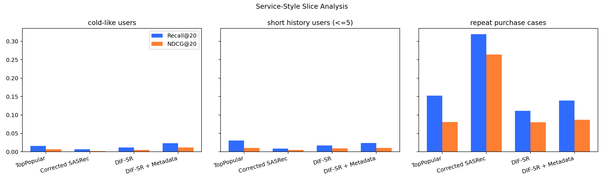

# Sequential Recommendation under Sparse Interaction Regimes in a Real Fashion Purchase Dataset

Sparse한 marketplace형 환경의 추천 시스템을 다루는 더 큰 연구 맥락 안에서 진행한 작업입니다.

H&M 거래 데이터 기반 구매 시퀀스를 사용해, 극도로 희소한 상호작용 환경에서 sequential recommendation이 어떻게 동작하는지 분석합니다.

## Abstract

Real fashion purchase dataset을 바탕으로 sparse interaction regime 하의 sequential recommendation을 분석합니다. 핵심 질문은 item metadata가 recommendation quality를 개선하는지, 그리고 어떤 user regime에서 그 효과가 가장 크게 나타나는지입니다.

- `TopPopular` remains the strongest overall baseline.
- `DIF-SR + Metadata` is the strongest personalized model.
- Metadata is most useful under weak behavioral signals such as cold-like and short-history regimes.
- Baseline verification materially changed the interpretation of model comparisons.

## Research Question

핵심은 weak behavioral signal 환경에서 sequential recommendation을 어떻게 해석해야 하는지에 있습니다.

| Research Question | Why It Matters |
| --- | --- |
| Can item metadata improve recommendation quality under weak behavioral signals? | sparse interaction history를 metadata가 얼마나 보완할 수 있는지 확인합니다. |
| Which user regimes benefit most from metadata-enhanced recommendation? | cold-like users와 short-history users처럼 metadata가 실제로 유용한 구간을 구분합니다. |
| How do backbone differences behave under sparse interaction regimes? | model architecture 차이가 dataset regime 효과와 어떻게 상호작용하는지 해석합니다. |

## Experiment Process

실험은 dataset construction, model training, evaluation, slice analysis, interpretation 순으로 진행했습니다.

| Phase | Main Action | Why It Mattered |
| --- | --- | --- |
| `Phase 1: Dataset Construction` | purchase dataset 구축, temporal train/test split | sequential recommendation setting을 정의하고 비교 가능한 evaluation base를 만듭니다. |
| `Phase 2: Initial Experiments` | SASRec baseline, DIF-SR implementation, metadata embedding experiments | 초기 backbone 비교와 metadata 효과를 빠르게 확인합니다. |
| `Phase 3: Baseline Sanity Check` | anomaly detection, causal masking issue discovery | 잘못된 baseline을 찾아내며, 이 단계가 이후 모델 비교 해석을 바꾸는 핵심 분기점이 됩니다. |
| `Phase 4: Baseline Correction` | corrected SASRec, fair comparison rerun | baseline validity를 회복하고 공정 비교 조건을 다시 맞춥니다. |
| `Phase 5: Slice Analysis` | cold-like users, short-history users, repeat purchases | 어떤 user regime에서 어떤 model이 유리한지 구조적으로 해석합니다. |
| `Phase 6: Robustness Evaluation` | service-style evaluation, relaxed filtering | canonical setting 바깥에서도 결과가 얼마나 유지되는지 확인합니다. |
| `Phase 7: Final Interpretation` | popularity dominance analysis, metadata usefulness analysis | 최종적으로 dataset regime, model behavior, evaluation meaning을 정리합니다. |

## Dataset

익명화된 로컬 H&M 거래 로그에서 구매 이벤트를 추출해 데이터를 구성했습니다. 사용자 ID는 해시된 식별자(`userhash32`)이며, 구매 이벤트를 timestamp 순으로 정렬해 sequence를 만들었습니다.

| Category | Details |
| --- | --- |
| Dataset statistics | Users `22,258`, Items `29,785`, Interactions `135,412`, Average sequence length `9.35`, Median sequence length `6`, Sparsity `99.98%` |
| Metadata features | `product_type`, `department`, `garment_group` |
| Dataset characteristics | 극도로 희소한 interaction matrix, 짧은 사용자 이력, 강한 popularity bias |
| Temporal split | `week < 27 -> train`, `week == 27 -> test` |
| Task setting | temporal next-item prediction |

## Experiment Orchestration Framework

실험은 재현성과 추적성을 확보하기 위해 agent-driven experimentation framework 위에서 운영했습니다.

핵심 framework documents:

- 정책: [`docs/framework/AGENT.md`](docs/framework/AGENT.md)
- 실행 절차: [`docs/framework/RUNBOOK.md`](docs/framework/RUNBOOK.md)
- 반복 루프: [`docs/framework/SELF_EVOLUTION_LOOP.md`](docs/framework/SELF_EVOLUTION_LOOP.md)
- 프로토콜: [`docs/framework/protocol.md`](docs/framework/protocol.md)

구조적으로는 reusable skills와 role-based agents를 바탕으로 preprocessing, training, evaluation, analysis, reporting을 나눠 운영합니다.

| Phase | Purpose | Typical Output |
| --- | --- | --- |
| `baseline verification` | baseline validity 점검 및 anomaly 확인 | sanity check, corrected baseline |
| `model comparison` | aligned setting에서 backbone 및 metadata variant 비교 | canonical model metrics |
| `slice analysis` | user regime별 성능 차이 해석 | cold-like, short-history, repeat-heavy findings |
| `robustness evaluation` | service-style setting에서 결과 안정성 확인 | supplementary metrics and plots |

## Baseline Verification

초기 SASRec baseline은 causal masking 누락과 지나치게 약한 학습 설정 때문에 신뢰하기 어려운 상태였습니다.

Sanity check 이후 causal masking을 복구하고, epoch 수, sequence length, embedding size를 포함한 학습 설정을 보다 합리적인 SASRec baseline 수준으로 다시 조정했습니다.

| Item | Initial SASRec | Corrected SASRec | Why It Matters |
| --- | --- | --- | --- |
| Implementation | missing causal masking | causal masking restored | sequential baseline으로서의 validity를 회복합니다. |
| Training setup | undertrained configuration | reasonable SASRec baseline configuration | underfitting 때문에 왜곡된 비교를 줄입니다. |
| `Recall@20` | `0.0006` | `0.0113` | baseline이 실제로 의미 있는 수준까지 회복됐는지 보여줍니다. |
| `NDCG@20` | `0.0002` | `0.0040` | ranking quality 해석이 달라집니다. |
| `MRR@20` | not tracked in initial run | `0.0020` | corrected baseline에서 rank-sensitive metric도 함께 확인할 수 있습니다. |

상세 메모:

- [`SASREC_SANITY_FIX.md`](SASREC_SANITY_FIX.md)

## Models

최종 비교는 non-personalized baseline, sequential baseline, intent-aware backbone, metadata-enhanced variant를 함께 놓고 해석하는 방식으로 구성했습니다.

| Model | Role | Description |
| --- | --- | --- |
| `TopPopular` | Non-personalized baseline | global popularity recommender |
| `Corrected SASRec` | Sequential baseline | Transformer 기반 sequential recommender |
| `DIF-SR` | Intent-aware backbone | intent-aware sequential recommender |
| `DIF-SR + Metadata` | Intent-aware + metadata | item metadata embedding을 결합한 DIF-SR |

## Canonical Evaluation (Primary Artifact)

연구용 비교는 confounding factor를 줄인 clean evaluation setting을 기준으로 정리했습니다.

Filtering rules: cold users 제거, cold items 제거, zero-history users 제거, repeat purchases 제거

### Results



| Model | Recall@20 | NDCG@20 | MRR@20 |
| --- | ---: | ---: | ---: |
| TopPopular | 0.0280 | 0.0102 | 0.0055 |
| Corrected SASRec | 0.0113 | 0.0040 | 0.0020 |
| DIF-SR | 0.0155 | 0.0061 | 0.0036 |
| DIF-SR + Metadata | 0.0184 | 0.0075 | 0.0045 |

**Takeaway:** personalized model 중 최고 성능은 `DIF-SR + Metadata`였지만, 전체 최고 성능은 여전히 `TopPopular`였습니다.

- [`reports/canonical_evaluation.md`](reports/canonical_evaluation.md)

## Service-Style Evaluation (Robustness)

추가로 실제 서비스 조건에 가까운 relaxed setting에서도 결과가 유지되는지 확인했습니다.

Relaxed filtering: cold-like users 허용, zero-history users 허용, repeat purchases 허용

### Results



| Model | Recall@20 | NDCG@20 | MRR@20 |
| --- | ---: | ---: | ---: |
| TopPopular | 0.0293 | 0.0111 | 0.0061 |
| Corrected SASRec | 0.0147 | 0.0099 | 0.0085 |
| DIF-SR | 0.0169 | 0.0086 | 0.0063 |
| DIF-SR + Metadata | 0.0202 | 0.0093 | 0.0063 |

**Takeaway:** service-style setting에서도 personalized model 중 최고 성능은 `DIF-SR + Metadata`였습니다.

- [`reports/service_style_evaluation.md`](reports/service_style_evaluation.md)

## Slice Analysis

### User Regime Preference Map

`🟩` strongest, `🟨` competitive, `⬜` not leading

| User Regime | `Corrected SASRec` | `DIF-SR` | `DIF-SR + Metadata` |
| --- | --- | --- | --- |
| Cold-like users | `⬜` | `🟨` | `🟩` |
| Short-history users | `⬜` | `🟨` | `🟩` |
| Repeat-heavy cases | `🟩` | `⬜` | `⬜` |



| Slice | Best Model | Metrics | Interpretation |
| --- | --- | --- | --- |
| Cold-Like Users | `DIF-SR + Metadata` | `Recall@20: 0.0233`, `NDCG@20: 0.0116` | behavioral signal이 약할수록 metadata의 가치가 더 커집니다. |
| Short History Users | `DIF-SR + Metadata` | `Recall@20: 0.0239`, `NDCG@20: 0.0107` | 짧은 interaction history에서는 metadata가 추천 성능을 뚜렷하게 개선합니다. |
| Repeat Purchase Cases | `Corrected SASRec` | `Recall@20: 0.3194`, `NDCG@20: 0.2640` | repeat-heavy scenario는 일반적인 sparse recommendation보다 memorization problem에 더 가깝게 동작합니다. |

## Result Interpretation

| Condition | What Happens | Interpretation |
| --- | --- | --- |
| Sparse interaction regime | behavioral signal becomes weak | model architecture alone struggles to overcome sparsity |
| Cold-like / short-history users | `DIF-SR + Metadata` performs best | metadata becomes more valuable when user history is weak |
| Strong popularity bias | `TopPopular` remains strongest overall | global popularity dominates personalized signal in this dataset |
| Repeat-heavy scenario | `Corrected SASRec` performs well | this regime behaves more like sequence memorization than sparse discovery |

이 결과는 복잡한 model architecture만으로는 extreme sparsity를 쉽게 극복하기 어렵다는 점을 보여줍니다. 실제 개선에는 metadata signal, 더 풍부한 behavioral history, 도메인 특화 recommendation policy가 함께 필요합니다.

## Why Does Popularity Dominate in This Dataset?

`TopPopular`가 overall strongest model로 남은 이유는 이 데이터셋의 세 가지 구조적 특성으로 설명할 수 있습니다.

### 1. Extremely Sparse Interaction Matrix

`22k` users, `29k` items, `135k` interactions

평균 sequence 길이 약 `9`, 중간 sequence 길이 `6`

대부분의 사용자는 아주 적은 수의 item과만 상호작용합니다. behavioral evidence가 부족한 환경에서는 personalized signal보다 global popularity가 더 안정적으로 작동합니다.

### 2. Short User Histories

`behavior signal < popularity signal`

상당수 사용자가 short-history regime에 속하기 때문에, sequential model이 활용할 과거 패턴 자체가 제한적입니다.

### 3. Marketplace-like Demand Distribution

구매 데이터는 heavy-tailed demand distribution을 따르며, 인기 item이 test target으로 자주 등장합니다. 이 구조는 popularity-based recommender를 자연스럽게 유리하게 만듭니다.

### 4. Implications for Recommender Systems

희소 추천 환경에서는 모델 구조 개선만으로 popularity baseline을 넘기기 어렵습니다. 실제 개선은 metadata 같은 추가 signal, 더 풍부한 interaction history, stronger candidate generation, domain-specific policy를 함께 필요로 합니다.

## Reproducibility

### Supported Scope

- saved outputs 기반 research analysis 재생성
- service-style supplementary report 재생성
- portfolio plots 및 curated reports 재패키징

### Unsupported Scope

- original local transaction data로부터의 full dataset rebuild
- raw data에서 시작하는 end-to-end training reproduction

### Commands

Run main research analysis:

```bash
source .venv/bin/activate
python experiments/run_evaluation.py
```

Run phase-aware automation entrypoint:

```bash
python scripts/run_phase_agent.py
```

Generate service-style supplementary evaluation report:

```bash
source .venv/bin/activate
python scripts/generate_service_style_eval.py
```

Generate final portfolio plots and curated reports:

```bash
source .venv/bin/activate
python experiments/package_portfolio_artifact.py
```

Key artifacts:

- baseline sanity note: [`SASREC_SANITY_FIX.md`](SASREC_SANITY_FIX.md)
- canonical report: [`reports/canonical_evaluation.md`](reports/canonical_evaluation.md)
- service-style report: [`reports/service_style_evaluation.md`](reports/service_style_evaluation.md)
- portfolio summary: [`reports/research_summary.md`](reports/research_summary.md)
- repository guide: [`REPOSITORY_GUIDE.md`](REPOSITORY_GUIDE.md)
- update log index: [`updates/README.md`](updates/README.md)
- phase-agent logs: [`updates/4.portfolio-closure/`](updates/4.portfolio-closure)
